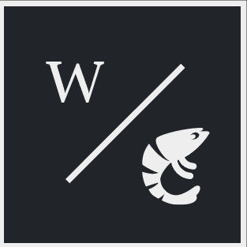
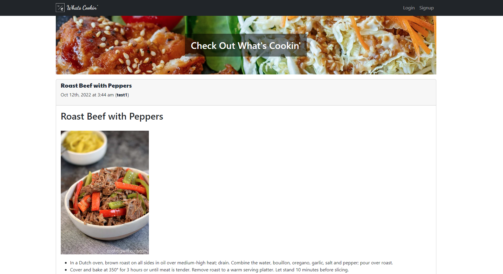

<div align="center">
  <a href="" rel="noopener">
  </a>
</div>
<br/>


# Whats Cookin'

A food blogging app where users can post recipes and pictures, as well as interact with others.

## Table of Contents
  - [Screenshot](#description)
  - [User Story](#user-story)
  - [Tech](#tech)
  - [Usage](#usage)
  - [Contributing](#contributing)
  - [Questions](#questions)
  - [Links](#links)

## Screenshot




## User Story

As a user, I want to be able to post recipes, and pictures to those recipes on a blog site.

As a user I want to be able to interact with others' recipes, and have others interact with mine.

As a user, I want all of my recepies to be saved to my public profile.

## Tech

### Front End
- HTML
- CSS
- Javascript
- REACT
- Bootstrap

### Back End
- Node.js
- Express
- GraphQL


## Usage

Clone this repository, navigate to the root directory, and run the following:

```sh
npm run install
npm run seed
npm run develop
```

## Contributing

- [Shu Yang](https://github.com/NewChap2022)
- [Charles Zacour](https://github.com/DexZax)
- [Ryan Raposo](https://github.com/ryanraposo)
- [Daniel Rubino](https://github.com/RubinoD1)

## Questions

Questions? Please reach out to any of the team members listed above.

## Links

See the deployed site at: https://floating-river-67151.herokuapp.com/